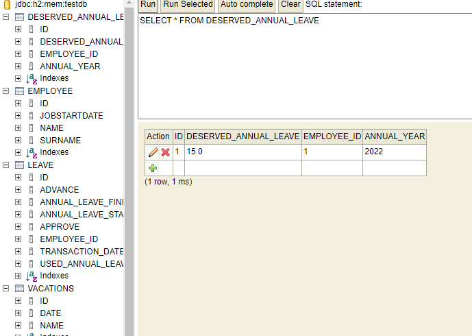
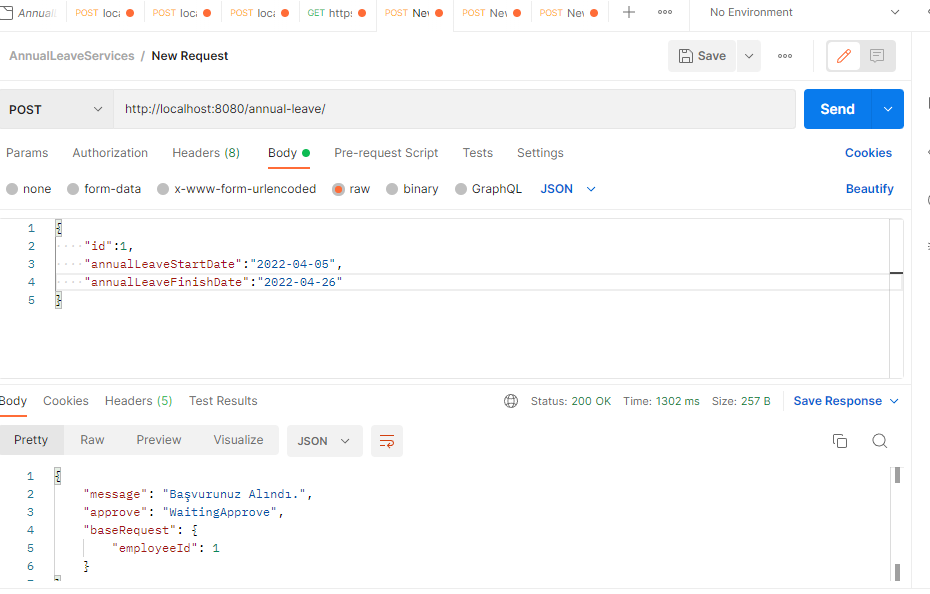
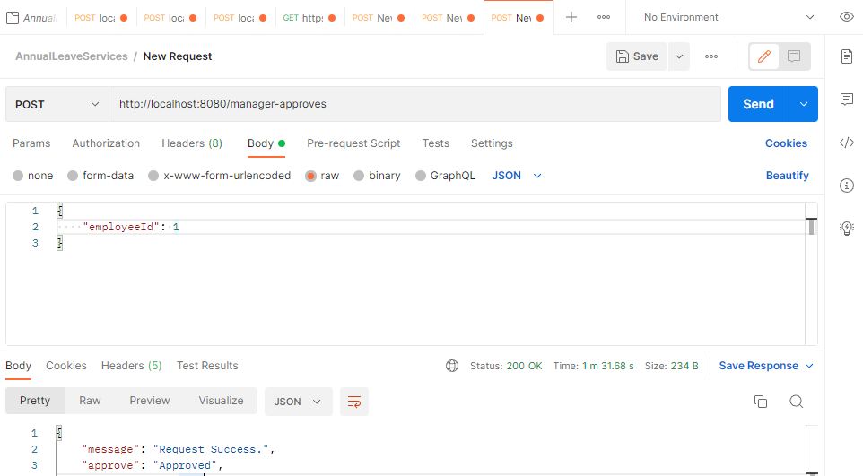

# Annual Leave Service
> Uygulamada h2 embedded database kullanıldı. Swagger entegrasyonu yapıldı. Exception multi language mesajlar için yapı kuruldu.

## Table of Contents
* [Use](#technologies-used)
* [Technologies Used](#technologies-used)
* [Features](#features)
* [Contact](#contact)

##Use
- Uygulama başlatılırken data.sql için bir "çalışan" employee kaydedilir.
- http://localhost:8080/h2-console adresinden tablolara erişilebilir.
- Tablolar :
- Deserved Annual Leave( Hak edilen Yıllık izin) , çalışanın çalıştığı yıla göre hakettiği izin bilgisini tutar.
- Employee, Çalışan bilgiler ve işe giriş tarihi
- Personal Annual Leave (Çalışan İzin bilgileri), yıllık izin bilgileri, avans, onay,kullanılan izin, izin başlangıç ve bitiş tarihleri.
- Vacation (Bayram ve tatiller), resmi tatil bilgileri 2025'kadar. İzin tarihlerinden kontrol edilerek düşülür.

- 
- Örnek Senaryo : Avans için
- İlk olarak izin tarihler ve employee id ile bir request gonderilir.
- Burada 1 numaralı employe 1 yıldan az olarak resources>data.sql içinde kaydedildi.
- Yapılan istek sonucu talebin alındığı bilgisi döndü.aprrove onay alanı Waiting Approve Onay Bekliyor statusunde.
  http://localhost:8080/annual-leave/
- 
- - Altta diğer adresi atılacak request için body bilgisi dönüldü.
- {  "employeeId": 1  }
- Sonraki adımda onay için aşağıdaki adrese request yapıldı.
- http://localhost:8080/manager-approves
- 
- - 1 yıldan az ve 5 günü aşmıyorsa onay verildi. Değilse Rejected dönecektir.

DateUtils
  - Burada bazı util fonksiyonları eklendi.
  - işe başlangıç tarihine göre 1 yıldan az olup olmadığı,
  - İzin tarihlerinin haftasonu olanların tespiti ve izin gününden çıkartılması.

<code>
     
    public static Integer isWeekend(final LocalDate startDate, final LocalDate endDate) {

      Integer dayCount=0;

      for (LocalDate date = startDate; date.isBefore(endDate); date = date.plusDays(1)) {

           DayOfWeek day = DayOfWeek.of(date.get(ChronoField.DAY_OF_WEEK));

           if(day == DayOfWeek.SUNDAY || day == DayOfWeek.SATURDAY){
               dayCount++;
           }
      }
      return dayCount;
    }
</code>
  - Diğerleri incelenebilir.
  - 

Enums
  - **ApproveType**
  - APPROVED(1,"Approved"),
  - REJECTED(2,"REJECTED"),
  - WAITING_APPROVE(3,"WaitingApprove");
  - Annual Leave tablosunda approve alanı değerleri.

Localization Exception Messages
  - exception package içinde ilgili sınıflar mevcuttur.
  - resource altında messages.properties ve messages_en.properties dosyaları oluşuturuldu.
  - message.parse_exception = Tarih formatı hatalı
  - message.parse_exception = Error date format!
  -  throw new LocalizedException("message.parse_exception", Locale.US);

## Technologies Used
- Java 11
- Spring Framework
- Spring Boot
- JPA Spring Data
- MapStruct
- H2 in-memory database
- Lombok
- Swagger
- Gradle

## Features
OOP and SOLID principles have been applied.

## Contact
Linkedin : https://www.linkedin.com/in/gokhan-p-472b95160/
Created by gokhanpehh@gmail.com
